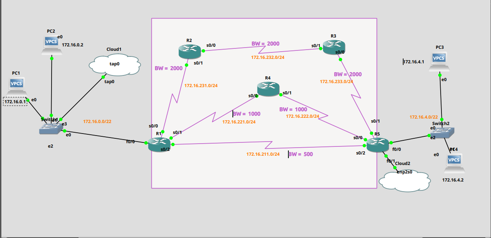

# mpls-traffic-engineering



# TP – MPLS – Dynamic Traffic Distribution & Tunnel

This repository contains a hands-on MPLS lab built in GNS3.  
The goal is to create a small “service provider” backbone, enable MPLS, and use Traffic Engineering (TE) to control how traffic is distributed across the network.

Originally done as a **TP – MPLS – répartition de trafic et tunnel dynamique** in a Networks & Telecommunications curriculum.

---

## 🎯 Objectives

This lab focuses on:

- Building a small **MPLS backbone** in GNS3  
- Running **OSPF** as the IGP  
- Enabling **MPLS ** on the core  
- Creating **Traffic tunnels** 
- Observing **traffic distribution / load sharing** across tunnels  
- Testing **path changes and behaviour** when links or tunnels fail  

##  🧠 Skills Developed

- Working on this lab helps develop:
- A practical understanding of MPLS in a service-provider style backbone
- Configuration of OSPF as an IGP in a multi-router environment
- Activation and verification of MPLS with LDP
- Use of Traffic Engineering tunnels to influence routing and avoid congestion
- Observation of how traffic paths change when links or tunnels fail
- A methodical approach to testing, troubleshooting and documenting a network lab
---

## 🗺 Topology

The lab uses a multi-router MPLS core with edge networks and end-to-end connectivity.

- Core routers interconnected in a partial mesh  
- Edge routers acting as customer/edge (CE/PE)  
- MPLS enabled in the provider core  
- OSPF providing IP reachability between all nodes  


```text
## Lab Setup
Prerequisites

GNS3 installed (local or GNS3 VM)

A valid Cisco IOS 2691 image, e.g.:
c2691-adventerprisek9-mz.124-5a.image

Basic knowledge of:
- Cisco CLI
- IP addressing & routing
- OSPF fundamentals
- MPLS & label switching (at least at a conceptual level)

⚠️ IOS images are not provided in this repo.
